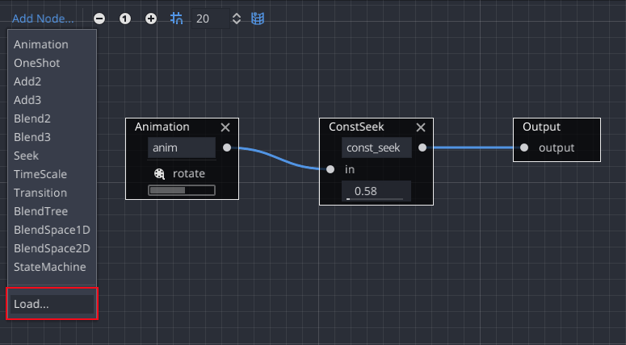

# Constant Seek AnimationNode for Godot Engine

Provides a custom `AnimationNode` resource usable in `AnimationTree` to constantly hold an animation at the same position.
It has the same interface as `AnimationNodeTimeSeek` but instead of jumping once to the given position and playing the animation from there, source animations are paused.

This can be used to programmatically (or via other animations) blend between keyframes – basically animating the animation cursor itself.

## Usage

- Copy the file `animation_node_const_seek.tres` to your project (wherever you like).
- To add the node to an `AnimationTree`, load the file via the `Load...` option in the `Add Node...` menu.

## Where is the Script?

The script is embed in the resource for simplicity. To view it, double click `animation_node_const_seek.tres` in the editor and click on the `script` resource in the `Inspector` tab. (Or look into the file, it's only text :)

## Notices

- Looped animations are repeated when seek position exceeds the length of an animation.
